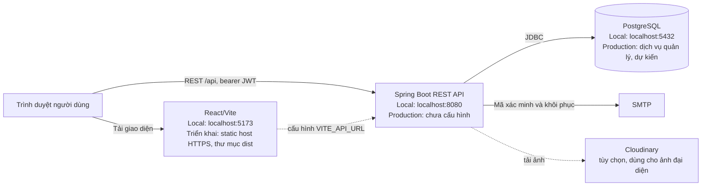

# Otech

Otech là ứng dụng cộng đồng và mua bán hàng hóa đã qua sử dụng. Repository gồm giao diện React/Vite và REST API xây dựng bằng Spring Boot.

## Tính năng

- Đăng ký tài khoản, xác minh email, đăng nhập và khôi phục mật khẩu.
- Xem bảng tin bài đăng công khai.
- Cập nhật hồ sơ, đổi mật khẩu và tải ảnh đại diện.
- Giao diện responsive, hỗ trợ chế độ sáng/tối và cài đặt PWA.

Các tính năng tìm kiếm/lọc, đăng và quản lý sản phẩm, thích/lưu/bình luận, nhắn tin, thông báo và quản trị chưa được kết nối đầy đủ với API. Một số nút chỉ thay đổi trạng thái giao diện; các tab Listings và Saved hiện là nội dung giữ chỗ. Backend có entity cho các miền dữ liệu rộng hơn nhưng chưa có API tương ứng.

## Cấu trúc dự án

```text
backend/otech/   Spring Boot API, Maven Wrapper và kiểm thử Java
frontend/        React/Vite, npm lockfile và cấu hình PWA
```

Backend tổ chức theo tính năng (`auth`, `post`, `profile`); entity, bảo mật, cấu hình và gửi email nằm trong package `com.vn.otech`.

## Kiến trúc triển khai

Sơ đồ dưới đây mô tả cách các thành phần kết nối khi phát triển local và khi triển khai theo mô hình dự kiến. Repository chưa có cấu hình hạ tầng production.



Frontend và backend là hai tiến trình riêng. Khi triển khai, cần cấu hình URL API ở thời điểm build frontend, CORS ở backend và secret ở môi trường chạy backend. SMTP và Cloudinary là dịch vụ ngoài; chỉ cần bật khi sử dụng các luồng tương ứng.

## Công nghệ

- Java 21 và Maven Wrapper
- Node.js và npm
- PostgreSQL
- SMTP để gửi mã xác minh và khôi phục mật khẩu
- Cloudinary để bật tải ảnh đại diện

Hibernate không tự tạo schema vì `spring.jpa.hibernate.ddl-auto=none`. File `script.sql` hiện nằm ở thư mục cha của repository trong workspace, nhưng không được Git của repository Otech theo dõi. Khi clone repository độc lập, cần cung cấp schema riêng trước khi chạy backend.

## Cấu hình

Backend đọc các biến môi trường sau. Hãy cấu hình chúng trong môi trường chạy, không ghi thông tin bí mật vào mã nguồn.

| Biến | Mục đích | Mặc định / ghi chú |
| --- | --- | --- |
| `DB_URL` | JDBC URL của PostgreSQL | `jdbc:postgresql://localhost:5432/Otech` |
| `DB_USERNAME`, `DB_PASSWORD` | Tài khoản cơ sở dữ liệu | Có giá trị dự phòng cục bộ; cần đặt tường minh |
| `JWT_SECRET` | Khóa ký JWT | Dùng khóa riêng, tối thiểu 32 byte |
| `JWT_EXPIRATION_MS` | Thời hạn JWT, mili giây | `86400000` |
| `SERVER_PORT` | Cổng API | `8080` |
| `CORS_ALLOWED_ORIGINS` | Danh sách origin frontend, phân tách bằng dấu phẩy | `http://localhost:5173` |
| `MAIL_HOST`, `MAIL_PORT`, `MAIL_USERNAME`, `MAIL_PASSWORD` | Kết nối SMTP | Mặc định host Gmail, cổng `587` |
| `MAIL_FROM` | Địa chỉ gửi email | Mặc định lấy từ `MAIL_USERNAME` |
| `MAIL_SMTP_AUTH`, `MAIL_SMTP_STARTTLS` | Xác thực SMTP và TLS | Mặc định bật |
| `CLOUDINARY_CLOUD_NAME`, `CLOUDINARY_API_KEY`, `CLOUDINARY_API_SECRET` | Lưu ảnh đại diện | Cần có để bật tải ảnh |
| `RESET_TOKEN_EXPIRATION_MINUTES` | Thời hạn mã khôi phục mật khẩu | `30` |
| `SIGNUP_OTP_EXPIRATION_MINUTES` | Thời hạn mã xác minh đăng ký | `10` |
| `LOGIN_MAX_FAILURES`, `LOGIN_LOCKOUT_MINUTES` | Giới hạn đăng nhập sai | `5` lần, khóa `15` phút |

Trong `application.properties` hiện còn giá trị dự phòng giống thông tin xác thực cho SMTP/Cloudinary và khóa JWT dành cho phát triển. Hãy coi các giá trị này là đã bị lộ: không dùng khi triển khai, thay bằng biến môi trường và thu hồi/đổi thông tin xác thực nếu chúng còn hiệu lực.

Frontend đọc tùy chọn `VITE_API_URL`, mặc định là `http://localhost:8080/api`. File mẫu nằm tại `frontend/.env.example`; có thể tạo `frontend/.env.local` để ghi URL riêng cho máy phát triển.

## Bắt đầu

1. Cài Java 21, Node.js/npm và PostgreSQL; tạo cơ sở dữ liệu rồi chạy schema được cung cấp cùng workspace. Đảm bảo URL và tài khoản cơ sở dữ liệu khớp với biến môi trường backend.
2. Mở PowerShell tại thư mục gốc `Otech`, cấu hình các biến môi trường backend ở trên. Cần SMTP để dùng đăng ký xác minh email/khôi phục mật khẩu; cần Cloudinary để tải ảnh đại diện.
3. Khởi động backend:

   ```powershell
   Set-Location backend/otech
   .\mvnw.cmd spring-boot:run
   ```

   API mặc định chạy tại `http://localhost:8080`.

4. Mở terminal khác, cài dependency và chạy frontend:

   ```powershell
   Set-Location frontend
   npm ci
   npm run dev
   ```

   Mở URL Vite in ra, thường là `http://localhost:5173`. Nếu API chạy ở địa chỉ khác, đặt `VITE_API_URL` trong `frontend/.env.local` thành URL gốc `/api`. Origin frontend phải có trong `CORS_ALLOWED_ORIGINS` của backend.

## API hiện có

Các endpoint dùng tiền tố `/api`.

| Phương thức | Endpoint | Quyền truy cập | Chức năng |
| --- | --- | --- | --- |
| `POST` | `/auth/signup` | Công khai | Đăng ký và gửi mã xác minh |
| `POST` | `/auth/verify-signup` | Công khai | Xác minh đăng ký và cấp JWT |
| `POST` | `/auth/resend-signup-otp` | Công khai | Gửi lại mã xác minh |
| `POST` | `/auth/login` hoặc `/auth/signin` | Công khai | Đăng nhập và cấp JWT |
| `POST` | `/auth/logout` | Công khai; nhận bearer token nếu có | Thu hồi token hiện tại khi token được gửi |
| `POST` | `/auth/forgot-password` | Công khai | Yêu cầu mã khôi phục mật khẩu |
| `POST` | `/auth/reset-password` | Công khai | Đặt lại mật khẩu bằng mã |
| `GET` | `/posts` | Công khai | Lấy danh sách bài đăng hiển thị |
| `PATCH` | `/user/profile` | Đã xác thực | Cập nhật hồ sơ, có thể đổi mật khẩu |
| `POST` | `/user/profile/avatar` | Đã xác thực | Tải ảnh lên bằng multipart field `file` |

Request cần xác thực gửi header `Authorization: Bearer <token>`. Frontend lưu token trong `localStorage` và gửi qua API helper dùng chung.

## Kiểm thử

Chạy frontend trong thư mục `frontend/`:

```powershell
npm run lint
npm run build
```

Chạy backend trong thư mục `backend/otech/`:

```powershell
.\mvnw.cmd test
```

Backend có unit test cho auth, email, post, profile và JWT, cùng một kiểm thử khởi động ứng dụng. Kiểm thử frontend, API độc lập, E2E và báo cáo coverage chưa được cấu hình. Lệnh lint hiện chưa đạt; xem mục Nợ kỹ thuật.

## Triển khai

Repository hiện chưa có CI/CD, Docker hay cấu hình staging/production. Các bước dưới đây hướng dẫn đóng gói thủ công; dự án chưa có môi trường production được cấu hình trong repository.

1. Chuẩn bị PostgreSQL bên ngoài và áp dụng schema tương thích với mã nguồn. Schema hiện phải được cung cấp riêng, vì vậy quy trình chưa thể tái lập chỉ từ repository.
2. Cấu hình secret trong secret manager của nền tảng: thông tin database, `JWT_SECRET`, SMTP và Cloudinary. Không dùng các giá trị dự phòng đang có trong mã nguồn. Đặt `SERVER_PORT` và `CORS_ALLOWED_ORIGINS` theo môi trường đích.
3. Đóng gói và chạy backend:

   ```powershell
   Set-Location backend/otech
   .\mvnw.cmd clean package
   ```

   Artifact dự kiến: `target/otech-0.0.1-SNAPSHOT.jar`. Chạy bằng `java -jar target/otech-0.0.1-SNAPSHOT.jar` sau khi đã cấu hình biến môi trường. Cần bổ sung health check và log/giám sát trước khi mở dịch vụ production.

4. Build frontend:

   ```powershell
   Set-Location frontend
   npm ci
   npm run build
   ```

   Phân phối thư mục `dist/` qua static hosting có HTTPS và fallback về `index.html` cho SPA. Đặt `VITE_API_URL` trước khi build để nhúng URL API môi trường đích; cấu hình CORS backend cho đúng origin frontend.
5. Trước khi mở truy cập, kiểm tra đăng nhập, xác minh email, hồ sơ, kết nối database và upload ảnh. Lưu artifact/version đã phát hành và ghi lại quy trình rollback; hiện chưa có rollback tự động, health-check endpoint, giám sát/cảnh báo hoặc bằng chứng triển khai staging/production.

## Nợ kỹ thuật và kế hoạch xử lý

Danh sách dưới đây sắp xếp các việc cần xử lý theo mức độ ưu tiên. P0 cần hoàn thành trước khi triển khai dùng thật; P1 trước khi mở staging; P2 nhằm cải thiện khả năng bảo trì và vận hành.

| Ưu tiên | Nợ kỹ thuật | Kế hoạch xử lý | Điều kiện hoàn tất |
| --- | --- | --- | --- |
| P0 | **Credential trong cấu hình:** `application.properties` có giá trị mặc định giống thông tin xác thực SMTP/Cloudinary và khóa JWT phát triển. | Thu hồi/đổi credential còn hiệu lực; bỏ secret khỏi giá trị mặc định; cấp secret qua secret manager hoặc biến môi trường riêng cho từng môi trường. | Secret scan không còn credential; ứng dụng khởi động với secret cấu hình từ môi trường; không dùng chung khóa giữa local/staging/production. |
| P0 | **Schema không nằm trong repository:** `script.sql` ở ngoài repo; Hibernate không tự tạo schema. | Đưa schema vào repository hoặc bổ sung công cụ migration có version; thêm hướng dẫn tạo database sạch. | Một contributor clone mới có thể tạo schema và chạy test/integration setup mà không cần file ngoài workspace. |
| P1 | **Lint frontend chưa đạt:** lần kiểm tra hiện tại `npm run lint` báo 45 lỗi và 4 cảnh báo; ESLint quét cả `frontend/dev-dist` cùng một số file source có lỗi. | Loại trừ artifact sinh tự động khỏi phạm vi lint; sửa các lỗi lint trong source; giữ lệnh lint trong CI. | `npm run lint` chạy thành công trên source; CI chặn merge khi lint thất bại. |
| P1 | **Thiếu kiểm thử giao diện và tích hợp:** backend có unit test nhưng chưa có kiểm thử frontend, API/E2E hoặc báo cáo coverage. | Bổ sung kiểm thử API cho auth/profile/posts; thêm E2E cho luồng người dùng chính; cấu hình thu thập coverage và kiểm thử trường hợp lỗi/biên. | Các luồng chính được kiểm tra tự động; pipeline tạo báo cáo coverage và đạt ngưỡng do nhóm thống nhất. |
| P1 | **Chức năng marketplace chưa hoàn chỉnh:** chưa có API CRUD sản phẩm, tìm kiếm/lọc, chat, tương tác bài đăng, Page, thông báo và xử lý báo cáo/quản trị; một số UI chỉ đổi state cục bộ hoặc giữ chỗ. | Chốt phạm vi release; với từng user story, bổ sung acceptance criteria, API/UI, kiểm thử và cập nhật tài liệu; ẩn hoặc vô hiệu hóa phần chưa hỗ trợ. | 100% tính năng đã cam kết có acceptance criteria, luồng backend/frontend, kiểm thử và tài liệu tương ứng. |
| P1 | **Chưa có quy trình CI/CD và phát hành:** không tìm thấy workflow CI, Docker, security scan, staging, rollback hay monitoring. | Tạo pipeline build, lint, static/security analysis, test và đóng gói; cấu hình secret management; bổ sung quy trình phát hành, rollback, health check, log và cảnh báo. | Pipeline xanh ổn định; có hướng dẫn staging/production đã chạy thử, version phát hành và rollback được kiểm chứng. |
| P1 | **Giới hạn mở rộng của khóa đăng nhập:** bộ đếm thất bại trong `ConcurrentHashMap` của `AuthService`, chỉ tồn tại trong một tiến trình và mất khi restart. | Chuyển trạng thái khóa sang kho dùng chung có thời hạn hoặc giới hạn triển khai ở một instance và ghi rõ giới hạn đó. | Hành vi khóa nhất quán qua nhiều instance/restart, hoặc kiến trúc single-instance được xác nhận và có biện pháp vận hành phù hợp. |
| P2 | **Thiếu tài liệu kiến trúc và dữ liệu:** chưa có đầy đủ sơ đồ nghiệp vụ, ngữ cảnh, thành phần, ERD và trình tự; chưa có từ điển dữ liệu, yêu cầu phi chức năng đo được và quyết định kiến trúc. | Bổ sung tài liệu cho các luồng và mô hình dữ liệu đang hoạt động; ghi lại lý do cho quyết định ảnh hưởng cấu trúc hệ thống. | Người tiếp nhận có thể lần theo luồng chính, hiểu schema và tra cứu lý do của quyết định kiến trúc. |

P0/P1/P2 là thứ tự ưu tiên đề xuất. Nhóm phát triển cần phân công người phụ trách và mốc thời gian cho từng hạng mục trong công cụ quản lý công việc.

